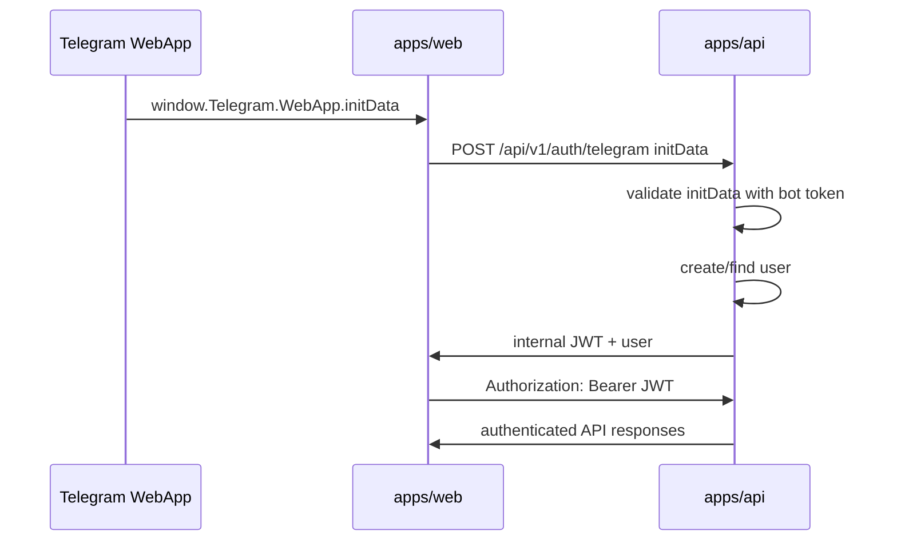
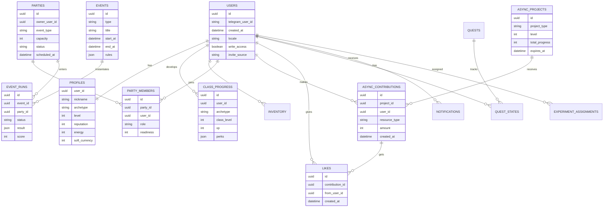

# Architecture

## Current repository

```text
/
  apps/
    api/                 # Fastify API, Telegram initData validation, internal JWT
    web/                 # React + TypeScript + Vite Telegram Mini App client
  packages/
    contracts/           # BUILD-P1 shared Zod schemas, DTOs, action metadata
  docs/
    ai/
    architecture/
    decisions/
    domain/
    metrics/
    roadmap/
    runbooks/
    status/
  AGENTS.md
  CLAUDE.md
  pnpm-workspace.yaml
```

## Target repository shape

```text
/
  apps/
    web/                 # Telegram Mini App client
    api/                 # HTTP API, bot webhook, auth, scheduled jobs
  packages/
    contracts/           # Zod schemas, DTOs, shared API types
    game-core/           # rules engine, formulas, rewards, event logic
    config/              # shared TypeScript/lint/test config if needed
  docs/
    roadmap/
    status/
    architecture/
    domain/
    decisions/
    runbooks/
```

Create `packages/contracts` and `packages/game-core` when BUILD-P1/P2 needs real shared contracts or formulas. Do not create shared packages as empty abstraction theater.

## Stack

| Layer | Default | Status |
| --- | --- | --- |
| Monorepo | pnpm workspaces | Current |
| Frontend | React + TypeScript + Vite | Current |
| Client server state | TanStack Query | Target |
| API | REST/JSON + shared Zod contracts | Current |
| Backend | Node.js + TypeScript + Fastify | Current |
| Domain layer | `packages/game-core` | Target |
| Contracts layer | `packages/contracts` | Current |
| Database | PostgreSQL | Current for BUILD-P1 |
| ORM | Prisma ORM | Current for BUILD-P1 |
| Managed DB | Neon | Target |
| Tests | Node test/Vitest + Playwright | Node test current, Vitest/Playwright target |

## BUILD-P2 additions

- `apps/api/src/social.ts` — pure domain helpers for contribution rewards, benefit payouts, and reputation deltas (mirrors `profile.ts` shape).
- Four new Prisma models: `Project`, `Contribution`, `BenefitClaim`, `ContributionLike`.
- `Profile.reputation` added.
- `ProfileEventType` extended: `project_contributed`, `project_unlocked`, `benefit_claimed`, `contribution_liked`, `reputation_gained`.
- Five new API endpoints: `GET /projects`, `POST /projects/:id/contribute`, `POST /projects/:id/claim-benefit`, `POST /contributions/:id/like`, `GET /feed`.
- Feed query: single `ProfileEvent.findMany` for feed-typed events, batched `User` + `Project` lookups (3 queries total), keyset pagination by `createdAt`.
- `apps/web/src/main.tsx` split into `app/`, `lib/`, `features/home`, `features/projects`, `features/feed`.
- Seed: `apps/api/prisma/seed.ts` provisions 3 campus projects (notes/botan, gym/sportsman, festival/partygoer) idempotently.

## BUILD-P1 additions

- `packages/contracts` now holds shared enums, DTO schemas, and action catalog metadata for the first player loop.
- `apps/api/prisma` owns the BUILD-P1 persistence schema and checked-in migration.
- `packages/game-core` is still intentionally absent because BUILD-P1 formulas are small and only used inside the API.

## Existing auth flow



Server-side initData validation is a hard boundary. The frontend may read Telegram data, but it must not be the trust boundary.

## Target domain data model



The full target schema also includes inventory, quests, notifications, and experiment assignments. Introduce tables only when the active phase needs them.

## Target API map

All product endpoints should be versioned under `/api/v1`.

| Method | Endpoint | Purpose |
| --- | --- | --- |
| POST | `/auth/telegram` | Validate Telegram initData and issue internal session/JWT |
| GET | `/me` | Current authenticated user; exists now |
| GET | `/health` | Health check; exists now |
| GET | `/profile` | Profile, resources, archetype, progress |
| POST | `/class/select` | Select archetype |
| POST | `/actions/perform` | Perform a short core-loop action |
| GET | `/projects` | Active async campus projects |
| POST | `/projects/{id}/contribute` | Contribute to a shared project |
| POST | `/projects/{id}/like` | Thank/like a contribution |
| GET | `/feed` | Social feed |
| POST | `/parties` | Create party |
| POST | `/parties/{id}/join` | Join party |
| POST | `/events/{id}/start` | Start party event |
| GET | `/quests` | Daily/weekly quests |
| POST | `/quests/{id}/claim` | Claim quest reward |
| POST | `/notifications/write-access` | Store bot write-access status |
| POST | `/analytics/events` | Accept product events |

## Key flows

```mermaid
flowchart TD
  subgraph Personal["Personal loop"]
    A["Open Mini App"] --> B["Server validates Telegram initData"]
    B --> C["Create or load profile"]
    C --> D["Choose archetype"]
    D --> E["Perform short action"]
    E --> F["Gain progress and readable reward"]
  end

  subgraph Async["Async contribution"]
    G["Open campus project"] --> H["Contribute resource or action"]
    H --> I["Project progress increases"]
    I --> J{"Threshold reached?"}
    J -->|"No"| K["Contribution appears in feed"]
    J -->|"Yes"| L["Project benefit unlocks"]
    L --> M["Other players use benefit"]
    M --> N["Author receives thanks and reputation"]
  end

  subgraph Exam["Cooperative Exam"]
    O["Create or join party"] --> P["Check readiness"]
    P --> Q["Start Exam"]
    Q --> R["Calculate archetype synergy"]
    R --> S{"Outcome"}
    S -->|"Success"| T["Reward and feed record"]
    S -->|"Partial failure"| U["Partial reward and next window"]
  end
```



## Architecture rules

- Keep auth, persistence, and domain decisions on the backend.
- Keep game formulas deterministic and testable; move them to `packages/game-core` once reused by API/tests.
- Use shared contracts once API responses become product-facing and stable.
- Every important player action should be loggable as a product event.
- Prefer simple vertical slices over premature platform layers.
