# Roadmap

## Principle

Development moves through closed vertical phases. Each phase must end in a working, verifiable product state, not a pile of half-finished systems.

The sequence is:

```mermaid
flowchart LR
  P0["BUILD-P0<br/>Project OS"] --> C0["CHECK-C0<br/>Shell control"]
  C0 --> P1["BUILD-P1<br/>First value"]
  P1 --> C1["CHECK-C1<br/>Personal loop control"]
  C1 --> P2["BUILD-P2<br/>Async social world"]
  P2 --> C2["CHECK-C2<br/>Social loop control"]
  C2 --> P3["BUILD-P3<br/>Cooperative Exam"]
  P3 --> C3["CHECK-C3<br/>Co-op event control"]
  C3 --> P4["BUILD-P4<br/>Alpha candidate"]
  P4 --> C4["CHECK-C4<br/>Alpha gate"]
```

## BUILD-P0 - Project Operating System

Goal: create a working monorepo shell that a developer or AI agent can run without oral explanation.

Includes:

- web/api monorepo shell;
- `.env.example` files;
- health endpoint;
- dev scripts;
- CI/deploy skeleton;
- root and local MD instructions;
- documented commands.

Acceptance:

- repository starts locally by documented commands;
- mandatory check commands exist and run;
- empty Telegram Mini App shell and API shell start;
- project documents describe the next phase clearly;
- health check works.

Do not do:

- game mechanics;
- social features;
- parties or events;
- interface polish.

## CHECK-C0 - Project OS Control

Verify only BUILD-P0:

- clean setup follows `docs/runbooks/COMMANDS.md`;
- mandatory check commands exist and work;
- monorepo structure is readable;
- project documents agree with each other;
- web shell and API shell launch.

Fix only issues that block the shell from running. Do not start game features.

## BUILD-P1 - First Value For A New Player

Goal: a new user enters the Mini App, gets first value in under a minute, understands their role, and sees saved progress.

Includes:

- Telegram auth remains server-validated;
- profile creation;
- selection of one of three archetypes: `botan`, `sportsman`, `partygoer`;
- one energy resource;
- one soft currency;
- 4-5 short actions;
- profile level and archetype progress;
- basic home screen;
- persistence after reload.

Acceptance:

- new user logs in through Telegram;
- user chooses an archetype;
- at least one meaningful action gives progress and reward;
- reload and repeated login show saved state;
- backend and frontend contracts agree;
- no blocking errors in logs.

Do not do:

- async shared world;
- parties;
- Exam event;
- complex inventory;
- PvP.

## CHECK-C1 - First Value Control

Verify BUILD-P0 and BUILD-P1:

- new user can enter through Telegram;
- role choice is meaningful and saved;
- one action gives first progress;
- progress survives reload and repeated login;
- first path does not need manual explanation.

Fix only missing pieces from these contracts. Do not add social world, parties, or Exam.

## BUILD-P2 - Async Social World

Goal: prove that one player can help others asynchronously and receive visible social feedback.

Includes:

- 2-3 campus projects such as notes, gym, or festival stage;
- contributions to shared projects;
- project progress and unlock threshold;
- feed entries;
- likes/thanks;
- reputation updates when others reuse a contribution;
- two-account scenario.

Acceptance:

- player A contributes to a shared project;
- player B uses the unlocked benefit;
- player A sees the social signal;
- feed reflects the event;
- state remains consistent after reload and repeated requests;
- duplicate rewards are prevented.

Do not do:

- cooperative Exam;
- guilds;
- PvP;
- complex seasons;
- new archetypes beyond the base three.

## CHECK-C2 - Async Social Loop Control

Verify BUILD-P0, BUILD-P1, and BUILD-P2:

- first player path still works;
- player A can contribute;
- player B can benefit;
- player A receives and sees social feedback;
- feed or equivalent social surface reflects the action;
- state is consistent after repeated requests and reload.

Fix only issues that block the promised social loop. Do not begin Exam or new modes.

## BUILD-P3 - Cooperative Event Exam

Goal: a small party enters the Exam event, where archetype composition affects outcome.

Includes:

- party create/join;
- party capacity of 3-5 players;
- readiness;
- auto-fill or manual invite path;
- event rules engine;
- success and partial failure outcomes;
- rewards;
- result entry in the social feed.

Acceptance:

- user can create or assemble a party;
- party can enter Exam;
- member roles influence probability and quality of result;
- success and partial failure are both possible and visible;
- rewards and feed result are written once without duplicates.

Do not do:

- PvP;
- deep season meta;
- battle pass;
- marketplace;
- unrelated independent modes.

## CHECK-C3 - Cooperative Event Control

Verify BUILD-P0 through BUILD-P3:

- early user paths still work;
- party can be created and filled;
- Exam depends on role composition;
- successful and partially failed paths exist;
- rewards and result records do not duplicate;
- result appears in the shared social space.

Fix only issues required to honestly close the cooperative event contract.

## BUILD-P4 - Alpha Candidate

Goal: make the product usable by first live users without constant manual support.

Includes:

- seed data so the social world is not empty;
- critical error handling;
- smoke e2e suite;
- basic bot notifications after first value moment;
- release checklist;
- staging deployment docs;
- DB recovery and rollback notes.

Acceptance:

- clean environment setup and seed work from runbook;
- new user reaches first value;
- async social loop works with two users;
- cooperative event is playable;
- basic notifications do not break the main path;
- no known critical blocker remains for the first external test.

Do not do:

- new game systems;
- new currencies;
- monetization;
- deep cosmetics;
- lore expansion for its own sake.

## CHECK-C4 - Alpha Gate

Verify the whole path BUILD-P0 through BUILD-P4:

- project starts from scratch;
- new user gets first value;
- social contribution works across two users;
- cooperative event is playable;
- seed and staging are reproducible;
- no known critical blocker remains.

Fix only what is critical for alpha readiness. Stop after confirmation.
